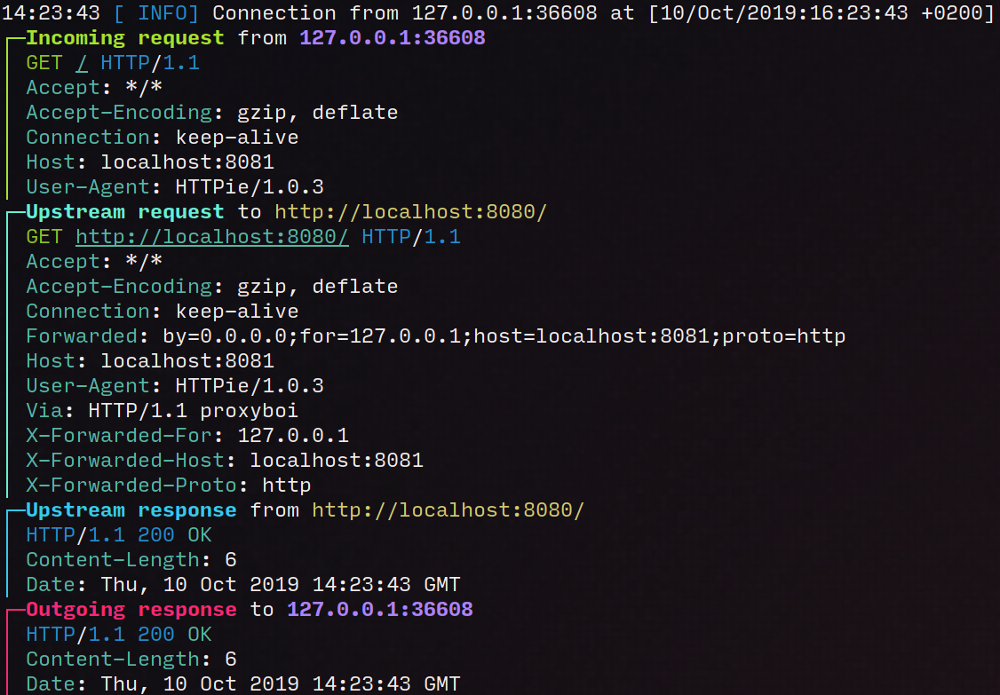

# proxyboi

**A super simple reverse proxy with TLS support**

## How to run

In order to listen for proxy requests on all local interfaces on port 8080 and proxy them to a service running at example.com, do:

    proxyboi -l 0.0.0.0:8080 http://example.com

You can also feed your TLS certificates into it:

    proxyboi -l 0.0.0.0:8080 --cert mycert.pem --key mykey.key http://example.com

You can see a detailed (and pretty!) verbose log using `-v`:

    proxyboi -l 0.0.0.0:8080 http://example.com -v

## Usage

    proxyboi 0.4.6-alpha.0
    Sven-Hendrik Haase <svenstaro@gmail.com>
    A super simple reverse proxy with TLS support

    USAGE:
        proxyboi [FLAGS] [OPTIONS] <upstream>

    ARGS:
        <upstream>    Upstream server to proxy to (eg. http://localhost:8080)

    FLAGS:
        -h, --help        Prints help information
        -k, --insecure    Allow connections against upstream proxies with invalid TLS certificates
        -q, --quiet       Be quiet (log nothing)
        -v, --verbose     Be verbose (log data of incoming and outgoing requests)
        -V, --version     Prints version information

    OPTIONS:
        -l, --listen <listen>                          Socket to listen on [default: 0.0.0.0:8080]
            --response-header <response-headers>...
                Additional response headers to send to requesting client

            --timeout <timeout>
                Connection timeout against upstream in seconds (including DNS name resolution)
                [default: 5]

            --cert <tls-cert>                          TLS cert to use
            --key <tls-key>                            TLS key to use
            --upstream-header <upstream-headers>...    Additional headers to send to upstream server

## Releasing

This is mostly a note for me on how to release this thing:

- Make sure `CHANGELOG.md` is up to date.
- `cargo release --dry-run <version>`
- `cargo release <version>`
- Releases will automatically be deployed by Github Actions.
- Docker images will automatically be built by Docker Hub.
- Update AUR package.
